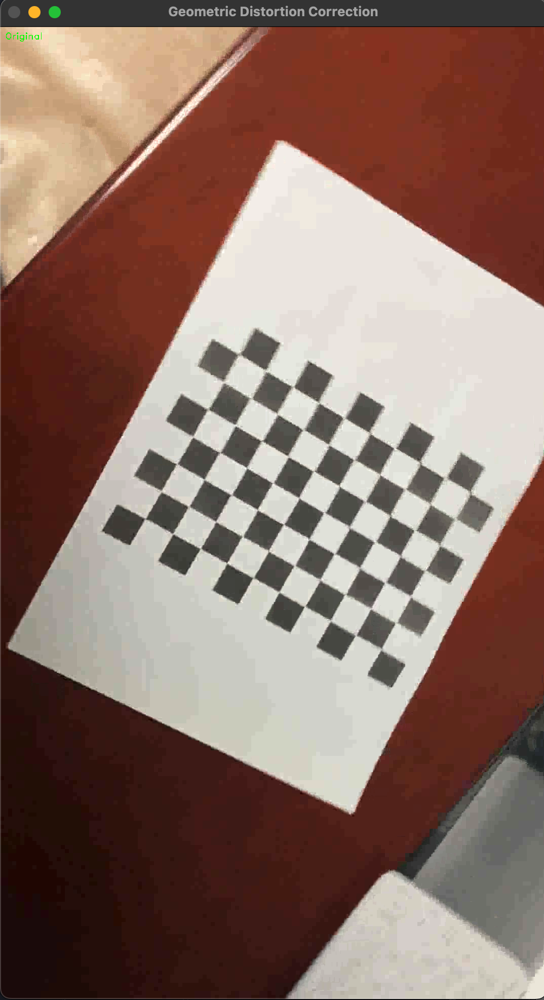
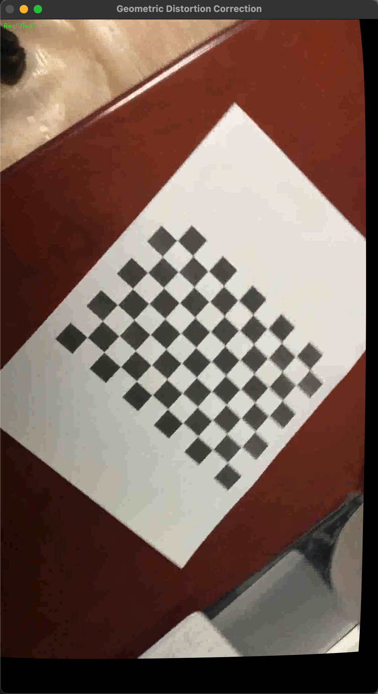

# checkboardchecker
간단한 카메라 캘리 프로그램입니다.

무엇을 하나요?
1. 비디오를 바탕으로 카메라 왜곡 값을 측정합니다.
2. 측정된 값을 바탕으로 비디오의 캘리브레이션 된 버전을 재생합니다.

## Camera Calibration Results

* The number of selected images = 19
* RMS error = 1.8460775286464666
* Camera matrix (K) = 
[[1.80903782e+03 0.00000000e+00 5.60007961e+02]
 [0.00000000e+00 1.80040519e+03 1.02771473e+03]
 [0.00000000e+00 0.00000000e+00 1.00000000e+00]]
* Distortion coefficient (k1, k2, p1, p2, k3, ...) = [ 0.28991389 -1.80286459  0.01603806  0.02280817  3.81601434]

## Lens Distortion Correction Demo

### Input Frame (Distorted)

### Output Frame (Undistorted)

- 보정된 결과에서 왜곡 현상(곡선 등) 제거 확인 가능
